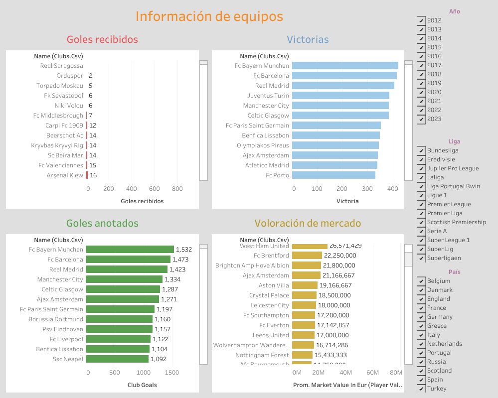
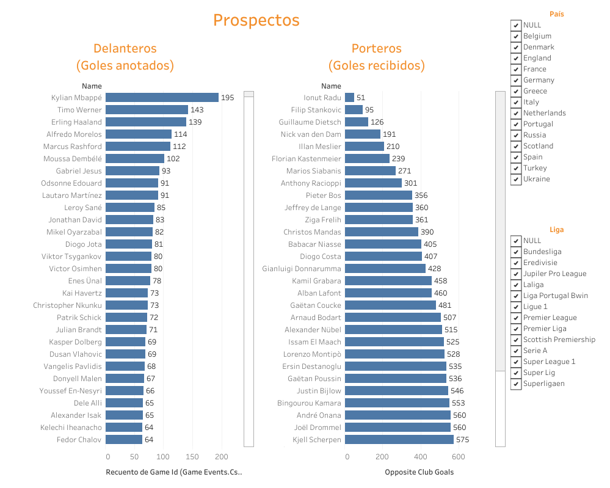

# Football Analytics Dashboard

## Overview

This project presents an interactive analysis of football teams and player scouting using Tableau dashboards.

It is designed to support decision-making for team performance evaluation and player recruitment.

---

## Problem

Football managers need tools to:

- Analyze team performance
- Compare teams across leagues
- Identify potential player signings based on performance and cost

---

## Dashboards

### Team Performance Dashboard

This dashboard allows:

- Analysis of goals scored and conceded
- Evaluation of team performance
- Comparison of teams by wins and market value
- Filtering by year and country

---

### Player Scouting Dashboard

This dashboard allows:

- Filtering players by:
  - Age (22–30)
  - Market value (< €30M)
  - League and country
- Evaluating performance:
  - Goals scored (forwards)
  - Goals conceded (goalkeepers)

---

## Key Insights

- Team performance varies significantly across leagues
- Offensive and defensive metrics are key for evaluation
- Player performance must be analyzed relative to cost
- Data helps identify high-value transfer opportunities

---

## Tools Used

- Tableau Public
- Data visualization
- Data modeling

---

## Live Dashboard

https://public.tableau.com/app/profile/samara.monserrat.salda.a.n.jera/viz/PruebaSamaraMonserratSaldaaNjera/4Dashboard

---

## Author

Samara Saldaña
